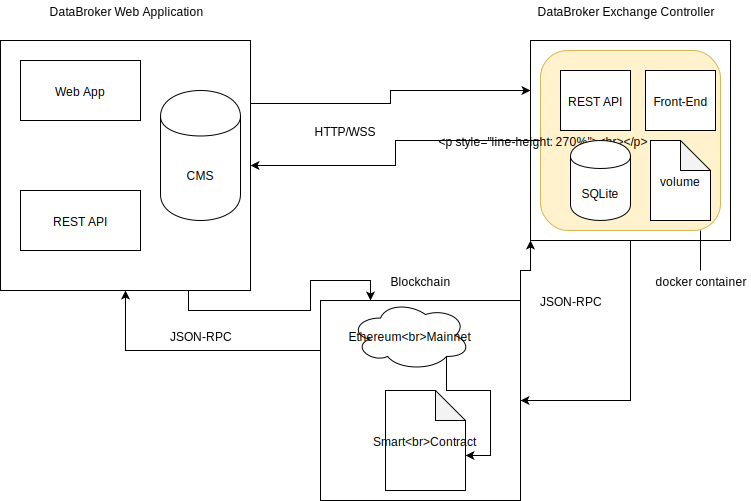

# DXC API

## Architecture MVP #1

## How to run

- Docker: docker-compose up -d --> navigate to localhost:8080
- Local executable: go build && ./dxc --> navigate to localhost:1323

## TODO

### File stuff

- [x] Upload file and make it match with file in volume
- [ ] Nice error handling when file doesn't match
- [ ] Store the upload event in db
- [ ] Unit test the crap out of it
